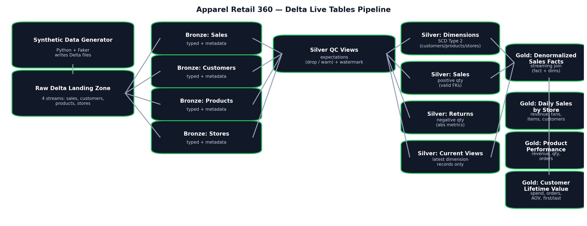

# Databricks DLT Streaming Medallion Pipeline

This project simulates an apparel retailer’s analytics backend. It continuously generates sales and dimension data, ingests it as streams, enforces data-quality rules, tracks historical dimension changes (SCD Type 2), and publishes curated Gold tables for reporting and analysis.



## What this project does

### Streaming data sources
A Python generator produces four Delta streams on a fixed interval:
- Sales transactions (fact stream)
- Customers (dimension stream with updates)
- Products (dimension stream with updates)
- Stores (dimension stream with updates)

Default generator settings (editable in the config):
- 500 sales rows per batch, every 30 seconds
- Up to 30 customer updates, 20 product updates, and 10 store updates per batch
- Up to 60 seconds of event-time skew to simulate late and out-of-order arrivals

### Medallion pipeline (Bronze, Silver, Gold)

**Bronze (raw, typed)**
- Reads streaming Delta files
- Adds ingestion metadata (ingest timestamp and source file path)
- Casts columns to stable types for downstream joins and aggregations

**Silver (quality and conformed)**
- Applies expectations to improve reliability:
  - hard fail or drop for missing primary keys, invalid prices/discounts, and missing foreign keys
  - soft warnings for questionable values (emails, age ranges, category/status, payment methods)
- Adds event-time watermarking (10 minutes) for stable streaming behavior
- Splits sales and returns (positive quantity for sales, negative quantity for returns)

**Silver dimensions with history (SCD Type 2)**
- Customers, products, and stores keep full attribute history using the latest update timestamp
- Ignores null updates to prevent accidental overwrites
- Excludes technical columns from history tracking (ingestion metadata and update timestamp)

**Gold (analytics-ready tables)**
- Builds a denormalized streaming fact table by joining sales with the current dimension snapshots
- Publishes three aggregate tables for business reporting:
  - Daily store performance (revenue, transactions, items sold, unique customers)
  - Product performance (revenue, quantity sold, orders)
  - Customer lifetime value (total spend, orders, first and last purchase, average order value)

## Outputs

### Bronze tables
- bronze_sales
- bronze_customers
- bronze_products
- bronze_stores

### Silver views and tables
- Cleaned/QC views for each stream (expectations and standardization)
- SCD Type 2 dimension tables for customers, products, and stores
- Sales transactions table (positive quantities only)
- Returns transactions table (negative quantities only, stored as absolute returned metrics)
- Current snapshot views for each dimension (latest active record)

### Gold tables
- Denormalized sales facts (streaming)
- Daily sales by store
- Product performance
- Customer lifetime value

## Tech stack
- Databricks Free Edition
- Delta Live Tables (DLT)
- PySpark DataFrames
- Delta Lake tables (streaming and batch)

## Repo structure

```
dlt/
  01_bronze.py
  02A_silver.py
  02B_silver.py
  02C_silver.py
  02D_silver.py
  03_gold.py
  data_generator.py
  variables.py
environment_setup.ipynb
environment_maintenance.ipynb
final_code/
  final_dlt.py
ProjectPlan.md
SynteticDataGenerator.md
```

## How to run (Databricks Free Edition)

1) Import the repo into Databricks (Repos or file import).

2) Configure `dlt/variables.py` with your catalog/schema and storage paths.  
If you use Unity Catalog, run `environment_setup.ipynb` first.

3) Start the synthetic data generator by running `dlt/data_generator.py` in a notebook cell.  
Keep it running to continuously write Delta files into the raw landing paths.

4) Create and run a Delta Live Tables pipeline:
- Workflows → Delta Live Tables → Create pipeline
- Add the pipeline source files (Bronze/Silver/Gold scripts) or use `final_code/final_dlt.py`
- Select a target schema and a storage location
- Start the pipeline

5) Validate in the DLT UI:
- Check expectation metrics (dropped rows and warnings)
- Confirm Gold tables are populated and updating

## Notes
- The generator waits until dimension tables have initial IDs before emitting sales, so sales records always reference known customers/products/stores.
- On restart, the generator resumes IDs from existing Delta tables to avoid collisions.
- Event-time watermarking is applied to handle late arrivals without breaking streaming aggregates.
